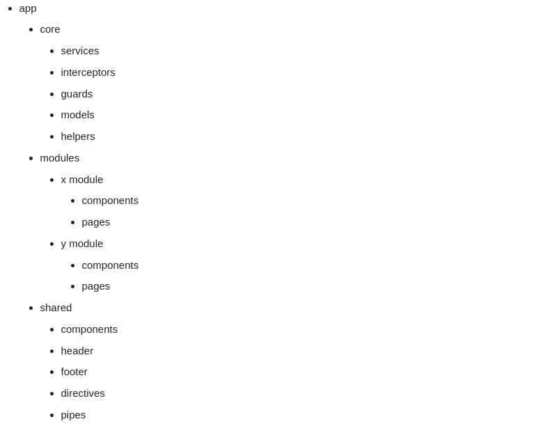

# About the project

Authentication in Angular V13.0 with NGRX (for state management) using JWT(Json Web Token).

## Project architecture
- 
- [StackOverFlow](https://stackoverflow.com/a/70525415)
- [Medium - Entreprise arch for angular](https://medium.com/@shijin_nath/angular-right-file-structure-and-best-practices-that-help-to-scale-2020-52ce8d967df5)

## Cmdlets

- `ng serve` :  run project `http://localhost:4200/`.
- `ng build` : build artifacts will be stored in the `dist/` directory.
- `ng test` : run unit tests via [Karma](https://karma-runner.github.io).
